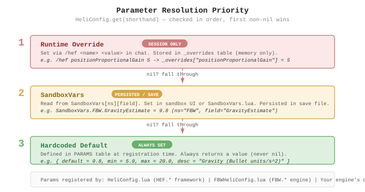

# HEF Administration Guide

Configuration reference for server admins and advanced users.

## Sandbox Options



Configured via the sandbox settings UI (game setup or server config). Persisted per-save.

### Framework Settings (HEF page)

| Setting | Default | Range | Description |
|---------|---------|-------|-------------|
| Flight Engine | FBW | (string) | Active flight engine name |
| Max Altitude | 8 | 1-50 | Flight ceiling in Z-levels |
| Warmup Frames | 10 | 1-120 | Startup delay before flight activates |
| Wall Damage Interval | 60 | 10-600 | Ticks between wall collision damage |
| Engine Off Fall Speed | 24.5 | 2-50 | Fall speed when engine is off (Bullet Y/s) |
| Fall PD Gain | 8.0 | 1-20 | Engine-off fall responsiveness |

### FBW Engine Settings (FBW page)

| Setting | Default | Range | Description |
|---------|---------|-------|-------------|
| Gravity Estimate | 10.0 | 5-20 | Gravity compensation strength (Bullet gravity = 10.0 m/s^2) |
| Engine Dead Condition | 10 | 0-100 | Engine condition % that triggers engine death |
| Engine Dead Fall Speed | 35.0 | 3-60 | Fall speed when engine is destroyed |
| Responsiveness Gain | 8.0 | 1-40 | Vertical PD gain (higher = snappier altitude response) |
| Braking Multiplier | 0.05 | 0.01-1.0 | Base inertia rate (lower = more momentum) |
| Accel Multiplier | 1.5 | 0.1-10 | Acceleration inertia multiplier |
| Decel Multiplier | 2.25 | 0.1-10 | Deceleration inertia multiplier |
| Ascend Speed | 6.0 | 1-30 | W key ascent speed (Bullet Y/s) |
| Descend Speed | 10.0 | 1-25 | S key descent speed (Bullet Y/s) |
| Max Horizontal Speed | 90.0 | 10-1000 | Speed at maximum tilt (m/s) |
| Yaw Speed | 0.7 | 0.1-5 | Yaw rotation speed (deg/frame at reference FPS) |

### TRQ Engine Settings (experimental)

The TRQ engine is a research prototype that replaces setAngles teleport with physics-native torque.
Switch in-game via `/hef engine TRQ`. These settings appear when TRQ is loaded.

| Setting | Default | Range | Description |
|---------|---------|-------|-------------|
| Pitch P Gain | 20 | 0.1-500 | Pitch proportional gain (inertia-normalized, rad/s^2 per rad) |
| Pitch D Gain | 6 | 0-100 | Pitch damping gain |
| Roll P Gain | 20 | 0.1-500 | Roll proportional gain |
| Roll D Gain | 6 | 0-100 | Roll damping gain |
| Yaw P Gain | 15 | 0.1-500 | Yaw proportional gain |
| Yaw D Gain | 5 | 0-100 | Yaw damping gain |
| Couple Offset | 1.0 | 0.1-5 | Couple-force arm length (meters) |
| Omega Alpha | 0.4 | 0.05-1 | Angular velocity EMA smoothing |
| Max Torque | 50000 | 100-500000 | Maximum torque per axis (Nm) |
| Gyro Scale | 0.0 | 0-2 | Gyroscopic feedforward (0=off, 1=full cancellation) |
| Warmup Frames | 20 | 1-120 | TRQ warmup frames |

TRQ shares FBW's gravity, vertical gain, brake/accel/decel, speed, and horizontal PD parameters.

## Chat Commands

Type `/hef` in chat. All commands are case-insensitive.

```
/hef help              List all commands and tunables
/hef show              Display all current parameter values
/hef engine [name]     Show active engine or switch to another
/hef reset             Reset all tunables to defaults
/hef vel               Show current Bullet velocity and mass
/hef log               Toggle periodic console logging
/hef snap              Detailed one-shot state dump to chat
/hef record            Toggle CSV flight data recording (per-frame)
/hef inertia           (TRQ) Show computed inertia tensor
/hef <name> <value>    Set any tunable or sandbox parameter
```

In multiplayer, write commands (set/reset) require admin access and are server-validated.

### Examples

```
/hef engine TRQ                Switch to torque engine
/hef engine FBW                Switch back to fly-by-wire
/hef maxHorizontalSpeed 120    Set max speed to 120 m/s (session override)
/hef positionProportionalGain 5    Reduce position correction strength
/hef trqPitchPGain 30         Increase TRQ pitch responsiveness
/hef gravity 12                Increase gravity compensation
/hef reset                     Restore all defaults
```

## Runtime Tunables

Set via `/hef <name> <value>`. Session-only — lost when the game exits. These are for experimentation and fine-tuning without restarting. Available tunables depend on the active engine.

### FBW Tunables

| Tunable | Default | Range | Description |
|---------|---------|-------|-------------|
| positionProportionalGain | 7.0 | 0.1-50 | Horizontal position correction strength (P gain) |
| positionDerivativeGain | 0.3 | 0-5 | Horizontal correction damping (D gain) |
| maxPositionError | 10.0 | 1-100 | Max correction distance in meters (tanh saturation) |
| finalStopDampingGain | 0.3 | 0-2 | Braking sharpness (0.3 = smooth, 0.8 = snappy) |
| yawCorrectionGain | 0.9 | 0-1 | Heading hold strength (0 = none, 1 = hard lock) |
| autoLevelSpeed | 1.0 | 0.1-5 | How fast tilt returns to level after key release |

### TRQ Tunables

All angular PD gains plus `trqCoupleOffset`, `trqOmegaAlpha`, `trqMaxTorque`, `trqGyroScale`,
and the shared horizontal PD tunables (positionProportionalGain, etc.).

Sandbox parameters can also be overridden for the session via `/hef <param> <value>`. The sandbox default is restored on game restart.

## Flight Data Recorder

The `/hef record` command toggles per-frame CSV recording. The file is written to your Zomboid user directory.

The recorder writes base columns (position, velocity, timing, keys) plus engine-specific columns
from `getDebugColumns()`. FBW adds sim model and error data. TRQ adds torque, omega, angular error,
up-vectors, and desired/actual angles. Column set is captured at recording start.

Use `tools/plot_flight.py` for visualization:
```
python tools/plot_flight.py HeliFlightLog_*.csv                    # all columns
python tools/plot_flight.py HeliFlightLog_*.csv --cols torqueX,torqueY,torqueZ
python tools/plot_flight.py HeliFlightLog_*.csv --skip ms,fps,state
```

The recording auto-stops when you exit the vehicle.

## Tuning Tips

**Helicopter feels sluggish?** Increase `maxHorizontalSpeed` or `accel`.

**Helicopter overshoots stops?** Increase `finalStopDampingGain` (up to 0.8) or `positionProportionalGain`.

**Hover drifts?** Increase `positionProportionalGain`. Default 7.0 provides stable hover for 20+ seconds.

**Yaw drifts during straight flight?** Increase `yawCorrectionGain` (default 0.9, max 1.0 for hard lock).

**Vertical response too slow?** Increase `verticalGain` (sandbox: Responsiveness Gain).

**Want manual control?** Toggle Flight Assist Off in the vehicle radial menu. Roll still auto-levels; pitch does not. Coast at current velocity above 1.5 m/s.

**TRQ oscillates?** Increase D gains (`trqPitchDGain`, `trqRollDGain`). With zero Bullet angular damping, the D-term is the only damping source.

**TRQ yaw overshoots?** Decrease `trqYawPGain` or increase `trqYawDGain`. Yaw has 45-degree lead clamp to prevent wrapAngle flip.
