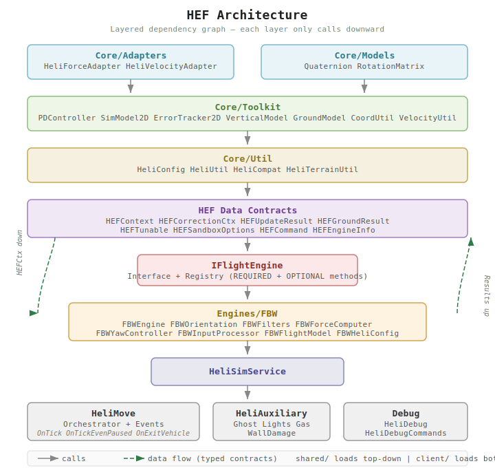
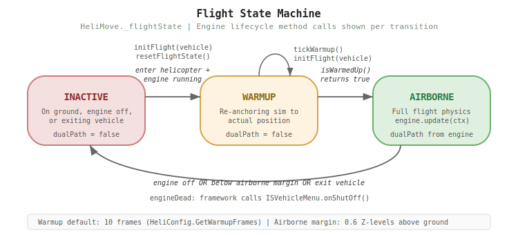

# HEF Developer Guide

How to create a custom flight engine for the Helicopter Flight Engine Framework.

## Architecture Overview

HEF uses a **strategy pattern**. The sandbox setting `HEF.FlightEngine` (string, default `"FBW"`) selects the active engine. Each engine is a self-contained table implementing `IFlightEngine`.

```
HeliMove (orchestrator)
  -> HEFContext.build()        builds per-frame context
  -> HeliSimService            thin dispatcher
     -> IFlightEngine.get()    resolves active engine
        -> YourEngine.update() your code runs here
```

Your engine receives a typed `HEFCtx` table every frame and returns results. The framework handles event registration, velocity smoothing, terrain scanning, wall detection, ghost mode, gas consumption, and all gameplay side-effects.





## Quick Start

### 1. Create your engine config

`shared/HEF/Engines/YourEngine/YourEngineHeliConfig.lua`:

```lua
HeliConfig.registerParams({
    myParam = {
        ns = "YourEngine", field = "MyParam",
        default = 1.0, min = 0, max = 10,
        desc = "My tunable parameter"
    },
}, { "myParam" })  -- display order

-- Typed getter (string key lives here only):
function HeliConfig.GetMyParam() return HeliConfig.get("myParam") end
```

### 2. Implement the engine

`shared/HEF/Engines/YourEngine/YourEngine.lua`:

```lua
YourEngine = {}

-- Implement all REQUIRED_METHODS (see below)
function YourEngine.update(ctx) ... end
function YourEngine.updateGround(ctx) ... end
function YourEngine.resetFlightState() ... end
function YourEngine.initFlight(vehicle) ... end
function YourEngine.tickWarmup() ... end
function YourEngine.isWarmedUp() ... end
function YourEngine.getTunables() ... end
function YourEngine.getTunable(name) ... end
function YourEngine.setTunable(name, value) ... end
function YourEngine.getSandboxOptions() ... end
function YourEngine.getDebugState() ... end
function YourEngine.getDebugColumns() ... end
function YourEngine.getIntendedYaw() ... end
function YourEngine.getCommands() ... end
function YourEngine.executeCommand(name, args) ... end
function YourEngine.getInfo() ... end

-- Register (with deferred fallback for load order safety)
if IFlightEngine then
    IFlightEngine.register("YourEngine", YourEngine)
else
    local function _deferred()
        IFlightEngine.register("YourEngine", YourEngine)
        Events.OnGameStart.Remove(_deferred)
    end
    Events.OnGameStart.Add(_deferred)
end
```

### 3. Add sandbox options

In `sandbox-options.txt`:

```
option YourEngine.MyParam
{
    type = double, min = 0, max = 10, default = 1.0,
    page = YourEngine,
    translation = YourEngine_MyParam,
}
```

### 4. Add translations

In `Translate/EN/Sandbox_EN.txt`:

```
Sandbox_EN = {
    Sandbox_YourEngine_MyParam = "My Parameter",
    Sandbox_YourEngine_MyParam_tooltip = "Description of what this does.",
}
```

### 5. Activate

Set `HEF.FlightEngine` to `"YourEngine"` in sandbox settings or `SandboxVars.lua`.

## IFlightEngine Interface

All required methods are validated at registration time. Missing a method causes an immediate error.

### Required Methods

| Category | Method | Signature |
|----------|--------|-----------|
| Frame update | `update` | `(ctx: HEFCtx) -> HEFUpdateResult` |
| Frame update | `updateGround` | `(ctx: HEFCtx) -> HEFGroundResult` |
| Lifecycle | `resetFlightState` | `()` |
| Lifecycle | `initFlight` | `(vehicle: BaseVehicle)` |
| Lifecycle | `tickWarmup` | `()` |
| Lifecycle | `isWarmedUp` | `() -> boolean` |
| Tunables | `getTunables` | `() -> HEFTunable[]` |
| Tunables | `getTunable` | `(name: string) -> number` |
| Tunables | `setTunable` | `(name: string, value: number)` |
| Sandbox | `getSandboxOptions` | `() -> HEFSandboxOptions` |
| Debug | `getDebugState` | `() -> table` |
| Debug | `getDebugColumns` | `() -> string[]` |
| Debug | `getIntendedYaw` | `() -> number (degrees)` |
| Commands | `getCommands` | `() -> HEFCommand[]` |
| Commands | `executeCommand` | `(name: string, args: string) -> string` |
| Metadata | `getInfo` | `() -> HEFEngineInfo` |

### Optional Methods

| Method | Signature | Description |
|--------|-----------|-------------|
| `applyCorrectionForces` | `(cctx: HEFCorrectionCtx)` | 0-frame delay horizontal correction (OnTickEvenPaused phase). Called when `update()` returns `dualPathActive = true`. |

## Context: What Your Engine Receives

Every frame, `update(ctx)` receives a typed `HEFCtx` table. All values are pre-read and coerced to Lua numbers.

### Input Fields

| Field | Type | Description |
|-------|------|-------------|
| `vehicle` | BaseVehicle | The helicopter (escape hatch for engine-specific modData) |
| `playerObj` | IsoPlayer | The pilot |
| `keys` | HEFKeys | `{up, down, left, right, w, s, a, d}` booleans |
| `fpsMultiplier` | number | `TARGET_FPS / actualFPS` (frame time scaling) |
| `fps` | number | Current FPS (clamped to MIN_FPS floor) |
| `heliType` | string | Helicopter type name (key into HeliList) |
| `currentAltitude` | number | Altitude in Z-levels |
| `groundLevelZ` | number | Ground height under helicopter (Z-levels) |
| `posX`, `posZ` | number | Vehicle position (PZ world coordinates) |
| `velX`, `velZ` | number | Smoothed horizontal velocity (m/s, stale-read corrected) |
| `velY` | number | Raw vertical velocity (m/s, direct from Bullet) |
| `mass` | number | Vehicle mass |
| `subSteps` | number | Integer physics sub-steps this frame (0 at very high FPS) |
| `physicsDelta` | number | Actual physics time this frame (seconds) |
| `blocked` | HEFBlocked | `{up, down, left, right}` wall collision booleans |
| `angleX`, `angleY`, `angleZ` | number | Vehicle Euler angles (degrees) |
| `positionDeltaSpeed` | number | Ground speed from position delta (m/s, immune to stale Bullet reads) |
| `fuelPercent` | number | Remaining fuel (0..100, lazy-read on first access) |
| `engineCondition` | number | Engine part condition (0..100, -1 if absent, lazy-read) |
| `scratchVector` | Vector3f | Reusable scratch vector (PZ API) |

### Output Closures

Use these instead of calling adapters or game APIs directly:

| Closure | Description |
|---------|-------------|
| `ctx.applyForce(fx, fy, fz)` | Apply physics force (Bullet space, handles Y/Z swap internally) |
| `ctx.setAngles(x, y, z)` | Set vehicle Euler angles (degrees) |
| `ctx.setPhysicsActive(active)` | Wake/sleep the Bullet physics body |

The correction context (`cctx`) provides `cctx.applyForce(fx, fy, fz)`, `cctx.velX`, `cctx.velZ`, `cctx.mass`, and `cctx.vehicle`.

## What Your Engine Must Return

### From `update(ctx)`

| Field | Type | Required | Description |
|-------|------|----------|-------------|
| `engineDead` | boolean | yes | Engine below death threshold (framework shuts off engine) |
| `dualPathActive` | boolean | yes | `true` = framework calls `applyCorrectionForces` next frame |
| `displaySpeed` | number | yes | km/h for speedometer display |
| `isBlockedHit` | boolean | no | Wall collision occurred (triggers damage) |
| `telemetrySpeed` | number | no | Speed for global telemetry (`Heli_GlobalSpeed`) |

### From `updateGround(ctx)`

| Field | Type | Required | Description |
|-------|------|----------|-------------|
| `liftoff` | boolean | yes | `true` = transitioning to airborne |
| `displaySpeed` | number | yes | km/h for speedometer display |

All type classes have EmmyLua `@class` annotations. Type `ctx.` in an EmmyLua-compatible IDE for full autocompletion.

## Toolkit (Optional Building Blocks)

The framework provides reusable utilities in `Core/Toolkit/`. Not required — engines can use raw math instead.

| Module | Description |
|--------|-------------|
| `CoordUtil` | PZ Y/Z swap helpers, m/s to km/h conversion |
| `VelocityUtil` | Horizontal speed, total speed, direction angle |
| `PDController` | Stateless PD controller with optional tanh saturation |
| `SimModel2D` | Instance-based 2D position/velocity simulator with inertia |
| `ErrorTracker2D` | Instance-based ring buffer for error tracking with derivative |
| `VerticalModel` | Default W/S/hover/fall vertical behavior (stateless) |
| `GroundModel` | Default ground hold + liftoff (stateless) |
| `Quaternion` | OOP quaternion class with metatables and convenience methods |
| `RotationMatrix` | 3x3 rotation matrix with PZ-specific semantic accessors |

## Parameter Registration

Engines register parameters with `HeliConfig.registerParams()` at file scope. Parameters become available through `/hef show` and `/hef <name> <value>` automatically.

Two kinds:
- **Sandbox params** (`ns` + `field` set): persisted per-save, appear in sandbox UI. Require matching entries in `sandbox-options.txt`.
- **Runtime-only params** (no `ns`/`field`): session-only overrides, useful for experimentation.

```lua
HeliConfig.registerParams({
    -- Sandbox-tunable (persisted)
    mySpeed = { ns = "MyEngine", field = "Speed", default = 10, min = 1, max = 100, desc = "Flight speed" },
    -- Runtime-only (session override)
    myGain  = { default = 5.0, min = 0.1, max = 20, desc = "Correction gain" },
}, { "mySpeed", "myGain" })  -- display order
```

See `FBWHeliConfig.lua` for a complete example.

## Project Structure

```
shared/HEF/
  HEFContext.lua              per-frame context builder + contract
  HEFCorrectionCtx.lua        correction-phase context builder
  HEF*Result.lua, HEF*.lua    typed return contracts (8 type files)
  Core/                        loads before Engines/ (C < E alphabetically)
    Adapters/                  HeliForceAdapter, HeliVelocityAdapter
    Models/                    Quaternion, RotationMatrix
    Toolkit/                   optional building blocks (see above)
    Util/                      HeliConfig, HeliUtil, HeliCompat, HeliTerrainUtil
  Engines/
    IFlightEngine.lua          interface + registry
    FBW/                       reference implementation (8 files)

client/HeliAbility/
  HeliSimService.lua           thin dispatcher (delegates to active engine)
  HeliMove.lua                 orchestrator (builds ctx, reads results, events)
  HeliAuxiliary.lua            ghost mode, lights, gas, damage
  Debug/                       HeliDebug, HeliDebugCommands
```

### Load Order

PZ loads `shared/` before `client/`, directories alphabetically depth-first. `Core/` (C) loads before `Engines/` (E), guaranteeing all framework globals exist when engine files execute. Within Core/: Adapters (A) < Models (M) < Toolkit (T) < Util (U).

### Dependency Direction

Data flows through typed contracts: `HEFCtx` down to engines, `HEFUpdateResult` back up. No mutual runtime dependencies. Each layer only calls downward. Engines are self-contained: register at load time, discovered via `IFlightEngine`.

## Kahlua Gotchas

PZ uses the Kahlua Lua VM, which has critical differences from standard Lua:

- **Java Float coercion**: `vehicle:getX()` returns a Java Float, not a Lua number. `tonumber()` returns `nil`. Comparisons (`<`, `>`) throw `__lt not defined`. Use `HeliUtil.toLuaNum(v)` (reliable: `tonumber(tostring(v)) or 0`).
- **Modulo is C-style**: `-5 % 30 = -5`, not 25. Add the modulus first if you need positive results.
- **`math.tanh` does not exist**. Compute manually: `(e^2x - 1) / (e^2x + 1)`.

See [KNOWLEDGE.md](KNOWLEDGE.md) for deep technical details on physics timing, rotation math, and the full rationale behind the FBW architecture.
